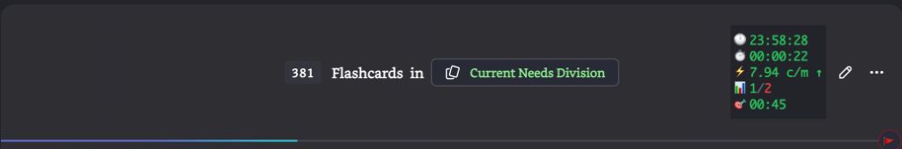

<h1 align="center">
	🎮⚡ FlashPad
</h1>

<h3 align="center">
	Supercharge Your Flashcard Sessions with Gamepad Control & Live Stats
</h3>

	<strong>Controller + Queue Tracker</strong> — The ultimate RemNote plugin for power studiers

---

## 📸 Screenshots

### Live Queue Statistics

	

Real-time performance tracking right in the queue toolbar:
- **🕐 Clock** — Current time
- **⏱️ Session** — Time spent in queue
- **⚡ Speed** — Cards per minute (color-coded: green = fast, red = slow)
- **📊 Score** — Passed / Failed count
- **🎯 ETA** — Expected completion time

---

## ✨ Features

### 🎮 Gamepad Controller Support
Connect any game controller and navigate flashcards hands-free!

- **Xbox, PlayStation, Nintendo** — Works with most controllers
- **Custom Button Mapping** — Assign any action to any button
- **Keyboard Shortcuts** — Map buttons to key combos (e.g., `Ctrl+I`)
- **Quick Actions** — Scroll Up/Down with dedicated buttons

### 📊 Live Queue Statistics
Real-time performance tracking during flashcard review.

### 🖥️ Modern Settings UI
Beautiful two-panel interface:
- Visual controller outline with button highlighting
- Clean mappings list with one-click configuration

---

## 🚀 Quick Start

1. **Install** from RemNote Plugin Store
2. **Connect** your controller via USB or Bluetooth
3. **Open** any Flashcard Queue
4. **Start studying** — buttons work immediately!

### Customize Controls
`Ctrl+K` → "Customize Controls (Gamepad)" → Click **Map** → Press keys → Save

---

## 🎯 Default Button Mappings

| Action | Xbox | PlayStation |
|--------|------|-------------|
| **Forgot** | Y | △ |
| **Easily Recalled** | A | ✕ |
| **Recalled with Effort** | B | ○ |
| **Partially Recalled** | X | □ |
| **Skip** | Start | Options |
| **Back** | Select | Share |

---

## 🙏 Credits

This plugin combines and enhances features from:

- **[Queue Motivator](https://github.com/voidtriangle/queue-motivator)** by @voidtriangle — Queue time tracking & stats
- **[RemNote Gamepad](https://github.com/coldenate/remnote-gamepad)** by @coldenate — Gamepad controller support

---

## 📅 Roadmap

- [ ] Controller profiles for multiple devices
- [ ] Connected indicator icon
- [x] ~~Button binding UI~~
- [x] ~~Live queue statistics~~
- [x] ~~Keyboard shortcut mapping~~

---

## 🐛 Issues & Feedback

Found a bug? Have an idea? [Open an issue](https://github.com/remnoteio/remnote-gamepad/issues)!

---

	Made with ❤️ for the RemNote community

